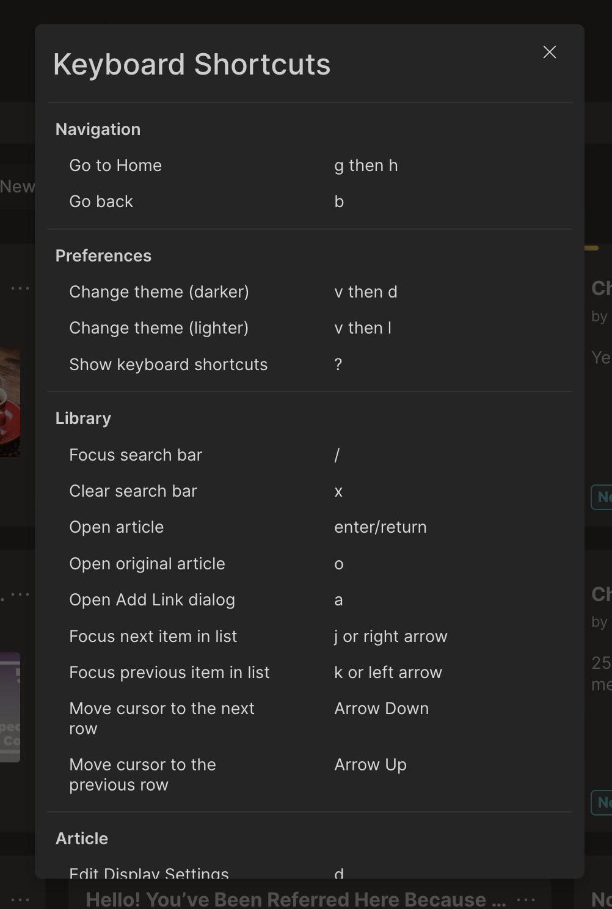

# {{ $frontmatter.title }}

[[toc]]

Omnivore Web客户端中的所有主要功能都可以通过键盘获得。有两种方法可以在 Omnivore 中使用键盘：打开命令栏并键入命令名称或直接使用键盘命令。

目前，键盘功能仅在 Web 上可用。

您可以通过点击 `?` 键查看所有可用的键盘命令。

## 键盘命令库

大多数库命令作用于当前选定的项目。例如，要存档库项目，请先选择它，然后点击 `e` 或使用命令栏存档该项目。

要选择库中的项目，请使用箭头键或 j 和 k 键。如果您的库处于网格模式，箭头键允许导航 `up`/`down` 和 `left`/`right`。 `j` 和 `k` 键将向前和向后导航。

- `enter`: 打开选定的库项目
- `o`: 打开原始版本
- `l`: 为所选项目设置标签
- `e`: 存档所选项目
- `r`: 删除项目
- `shift` `i`: 标记为已读
- `shift` `u`: 标记为未读

### 使用键盘添加链接

点击 `a` 键打开“添加链接”对话框

### 使用键盘在库中搜索

使用库视图中的 `/` 键开始搜索。要清除当前搜索，请点击 `x` 键。

## 阅读键盘命令

在阅读器中，您可以使用键盘命令调整显示设置、边距、行距和主题。您还可以对项目执行操作，例如从阅读器视图中存档和删除。

### 创建荧光笔高亮

在阅读器视图中选择文本后，可以通过点击 `h` 来创建突出显示。如果您想创建带有注释的突出显示，请点按 `n`.

### 更改显示设置

- `d`: 打开“显示设置”模式

### 文章操作

- `e`: 当前文章存档
- `l`: 设置标签
- `o`: 打开文章的原始版本

## 使用键盘在视图之间移动

您可以使用键盘在 Omnivore 中的视图之间移动。若要读取库项目，请先选择它，然后使用 enter 在阅读器视图中将其打开。阅读完毕后，您可以将其存档并使用 ‘e’ 返回图书馆，或使用 ‘u’ 键将向 “up” 移动到图书馆。

## 访问命令栏

命令栏允许您键入命令。在 MacOS 上使用 CMD+K 或在 Windows 上使用 CTRL+K 打开命令栏。

